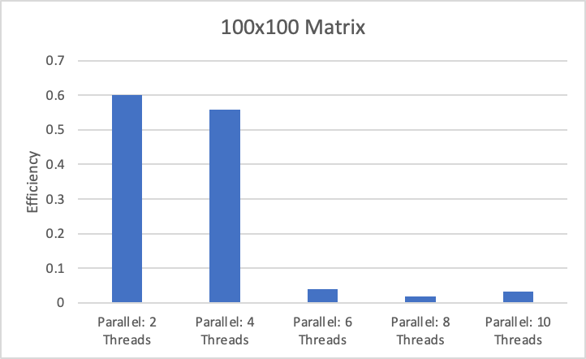

# CS 616: High Performance Computing

## Assignment 2: Fun with OpenMP

### Matrix Multiplicaiton Performance Analysis

#### Execution Time

|         | Serial   | 2 Threads | 4 Threads | 6 Threads | 8 Threads | 10 Threads |
| ------- | -------- | --------- | --------- | --------- | --------- | ---------- |
| **10**  | 0.000013 | 0.000238  | 0.00041   | 0.000126  | 0.000551  | 0.000516   |
| **50**  | 0.000057 | 0.000163  | 0.000036  | 0.000462  | 0.00051   | 0.000387   |
| **100** | 0.000172 | 0.000143  | 0.000077  | 0.000712  | 0.001212  | 0.000551   |
| **500** | 0.004165 | 0.003406  | 0.001428  | 0.002609  | 0.002632  | 0.002619   |

#### Speed Up

Equation: $S_p = \frac{T_s}{T_p}$  
&ensp;where $T_s$ is the time for a single processor run  
&ensp;and $T_p$ is the time using $p$ processors

|         | 2 Threads | 4 Threads | 6 Threads | 8 Threads | 10 Threads |
| ------- | --------- | --------- | --------- | --------- | ---------- |
| **10**  | 2.79e-01  | 2.20e-01  | 3.04e-1   | 1.09e-01  | 1.31e-01   |
| **50**  | 3.14737   | 4.51661   | 2.29119   | 2.42892   | 3.09204    |
| **100** | 2.52361   | 4.98612   | 2.72722   | 2.066489  | 2.39303    |
| **500** | 1.80493   | 3.17886   | 3.23146   | 3.43340   | 3.82141    |

#### Efficiency

Equation: $E_p = \frac{S_p}{p}$  
&ensp;where $S_p$ is the speed up  
&ensp;and $p$ is the number of processors

|         | 2 Threads | 4 Threads | 6 Threads | 8 Threads | 10 Threads |
| ------- | --------- | --------- | --------- | --------- | ---------- |
| **10**  | 1.39e-01  | 5.49e-02  | 5.06e-02  | 1.36e-02  | 1.31e02    |
| **50**  | 1.57368   | 1.12915   | 0.38186   | 0.30361   | 0.30920    |
| **100** | 1.26180   | 1.24653   | 0.45454   | 0.25831   | 0.23930    |
| **500** | 0.90246   | 0.79472   | 0.53858   | 0.42917   | 0.38214    |

#### Discussion

### Matrix Transposition Performance Analysis

#### Execution Time

|         | Serial   | 2 Threads | 4 Threads | 6 Threads | 8 Threads | 10 Threads |
| ------- | -------- | --------- | --------- | --------- | --------- | ---------- |
| **10**  | 1.30e-05 | 0.000238  | 0.00041   | 0.000126  | 0.000551  | 0.000516   |
| **50**  | 5.70e-05 | 0.000163  | 3.60e-05  | 0.000462  | 0.00051   | 0.000387   |
| **100** | 0.000172 | 0.000143  | 7.70e-05  | 0.000712  | 0.001212  | 0.000551   |
| **500** | 0.004165 | 0.003406  | 0.001428  | 0.002609  | 0.002632  | 0.002619   |

#### Speed Up

Equation: $S_p = \frac{T_s}{T_p}$  
&ensp;where $T_s$ is the time for a single processor run  
&ensp;and $T_p$ is the time using $p$ processors

|         | 2 Threads | 4 Threads | 6 Threads | 8 Threads | 10 Threads |
| ------- | --------- | --------- | --------- | --------- | ---------- |
| **10**  | 5.46e-02  | 3.17e-02  | 1.03e-01  | 2.36e-02  | 2.52e-02   |
| **50**  | 3.50e-01  | 1.58e+00  | 1.23e-01  | 1.12e-01  | 1.47e-01   |
| **100** | 1.20279   | 2.23377   | 0.24157   | 0.14191   | 0.31216    |
| **500** | 1.22284   | 2.91667   | 1.59640   | 1.58245   | 1.59030    |

#### Efficiency

Equation: $E_p = \frac{S_p}{p}$  
&ensp;where $S_p$ is the speed up  
&ensp;and $p$ is the number of processors

|         | 2 Threads | 4 Threads | 6 Threads | 8 Threads | 10 Threads |
| ------- | --------- | --------- | --------- | --------- | ---------- |
| **10**  | 2.73e-02  | 7.93e-03  | 1.72e-02  | 2.95e-03  | 2.52e-03   |
| **50**  | 0.17485   | 0.39583   | 0.02056   | 0.01397   | 0.01473    |
| **100** | 0.60140   | 0.55844   | 0.04026   | 0.017739  | 0.03122    |
| **500** | 0.61142   | 0.72917   | 0.26607   | 0.19781   | 0.15903    |

#### Discussion